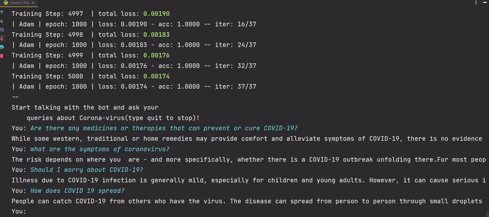

# Covid FAQ Bot 

This is a chatbot that will give answers to most of your corona related questions/FAQ. The chatbot will give you answers from the data given by WHO(https://www.who.int/). This will help those who need information or help to know more about this virus.

* It uses a neural network with two hidden layers(enough for these QnA) that predicts which pattern matches with the user's question and sends towards that node. More patterns can be added from user's questions to train it for more improved results and add more info about coronavirus in the JSON file

### PreRequisites:
* Python 3

* NumPy

* nltk

* TensorFlow v.1.15 (no GPU required)

* tflearn

>**We know neural networks and machine learning algorithms require numerical input. So out list of strings won't cut it. We need some way to represent our sentences with numbers and this is where a bag of words comes in.What we are going to do is represent each sentence with a list the length of the number of words in our model vocabulary. Each position in the list will represent a word from our vocabulary the position in the list is a 1 then that will mean that the word exists in our sentence, if it is a 0 then the word is nor present.**

### Demo

## How to Use

* Clone the Repo `gh repo clone mohammedkharoda/Covid-HelpBot`
* Run in terminal or Pychram 